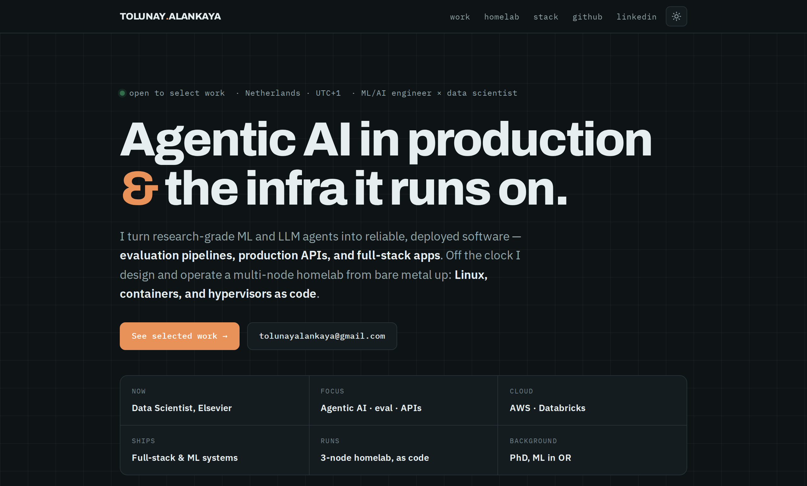

### [🌐&nbsp; Open the live, interactive portfolio &nbsp;→](https://ghostmastersc.github.io/GhostMasterSc/)

The page above is a preview — click it for the full site (light/dark, live links).

 
 

# Tolunay Alankaya

### Machine Learning / AI Engineer · Data Scientist

**Building agentic AI systems in production — and the infrastructure they run on.**

I turn research-grade ML and LLM agents into reliable, deployed software: evaluation
pipelines, production APIs, and full-stack apps. Off the clock, I design and operate a
multi-node homelab from bare metal up — Linux, containers, and hypervisors as code.

 

---

## 🚀 Currently

**Data Scientist @ Elsevier** — turning agentic LLM workflows into a dependable product surface.

- 🧪 **Design, build and maintain evaluation pipelines** for agentic flows — the harness that
  decides whether an agent is actually good enough to ship.
- 🧩 **Extend a mature, production API service** with new agentic tasks and capabilities.
- ☁️ Day-to-day on **AWS** and **Databricks**.

> The through-line of my work: *agents are only as trustworthy as the pipelines that evaluate them
> and the systems that serve them.* I care as much about the deployment, tests and observability
> as about the model.

---

## 🛠️ Featured Work

I build end-to-end. These are self-designed, self-hosted systems — architecture, code, deploy and ops all mine.

### 🏀 [Kukulitis](https://github.com/GhostMasterSc/Kukulitis) — full-stack fantasy-basketball analytics platform
A production-grade web app for ESPN head-to-head category leagues.

- **Backend:** FastAPI · SQLAlchemy 2 · Alembic migrations · APScheduler · NumPy/SciPy
- **Frontend:** React 19 · Vite · TypeScript · Tailwind v4 · TanStack Query
- **Engineering depth:** a cached, retrying ESPN client; a **research-backed draft algorithm**
  (H-scores) benchmarked to win the league ~1.9× as often as a G-score drafter; an *n*-for-*m*
  trade analyzer over real NBA schedules; a companion **browser extension** for live drafts.
- **Security:** argon2 hashing, httpOnly + SameSite sessions, CSRF guard, login rate-limiting,
  SSRF-protected webhooks, per-user data scoping, Fernet-encrypted credentials at rest.
- **Ops:** single-process prod deploy, Dockerized, private HTTPS via Tailscale, CI checks in one script.

`FastAPI` · `React` · `TypeScript` · `SQLAlchemy` · `Docker` · `Tailscale`

### 🐦 [Perry](https://github.com/GhostMasterSc/Perry) — cross-platform, privacy-first "save anything" app
A digital source organizer that reads what you save and files it for you — with the AI running on *your* hardware.

- **Monorepo:** `apps/mobile` (Expo / React Native, also web) · `apps/server` · `packages/core`
  (shared filing rules + offline classifier + app↔server contract) · `tools/shots` (e2e).
- **Self-hosted AI:** the optional helper runs **Ollama on your own GPU box** — captions never
  leave your network. Docker Compose deploy with `setup.sh` / `doctor.sh`, Tailscale Funnel access.
- **Shipped:** milestones M1–M9 complete, with a written security review and full verify/e2e suite.

`React Native` · `Expo` · `TypeScript` · `Ollama` · `Docker` · `monorepo`

### 📦 [machine-learning-for-inventory](https://github.com/GhostMasterSc/machine-learning-for-inventory) — ML engineering, done properly
Deep-learning / reinforcement-learning for inventory control, packaged like production software:
**MLflow** experiment tracking, a `Dockerfile.prod`, a test suite, and reproducible environments.

`PyTorch` · `MLflow` · `Docker` · `pytest`

---

## 🖥️ Homelab & Self-Hosted Infrastructure

> The part I'm proudest of. A real, always-on homelab that doubles as my DevOps proving ground —
> everything is **config-as-code**, versioned in git, and rebuildable from scratch.
> This is where I get hands-on with **Linux, Docker, and hypervisors** every week.

**[`jarvis`](https://github.com/GhostMasterSc/jarvis)** — the production server, as code.
17 self-hosted services in **Docker Compose** (Jellyfin, the *arr* stack, Nextcloud, Home Assistant,
Ghostfolio, Vikunja, Stirling-PDF and more), fronted by a homepage, driven by **systemd** units,
kept healthy by custom **Bash** watchdogs (VPN-bound qBittorrent, Home-Assistant config sync).
Secrets in gitignored `.env` files with committed `.env.example` templates; recovery runbooks in `docs/`.

**[`homelab-lab`](https://github.com/GhostMasterSc/homelab-lab)** — the lab and the discipline.
A project-based DevOps curriculum with a running **learning log** — every project ends with
something still running, gets deliberately broken, and is documented like an incident write-up.

| Machine | Role | Stack |
|---|---|---|
| **Jarvis** (ASUS ROG G14) | Always-on server | Ubuntu Server · Docker · systemd · Proxmox (planned) |
| **Mark-I** (Beelink 5850U) | Virtualization lab | **KVM / QEMU / libvirt** · cloud-init · k3s |
| **DXP4800 Pro** | NAS / storage | NFS · backups (restic) |

**Hands-on across the stack:** Linux internals (systemd, permissions, signals, boot analysis) ·
**hypervisors** — KVM/QEMU/libvirt VMs stamped out with cloud-init, headed toward Proxmox ·
**containers** — multi-stage builds, bridge networking, reverse proxies · **Kubernetes** (k3s,
Helm, GitOps with Argo CD) · **networking** — Tailscale mesh + MagicDNS, DNS, firewalls, NAT ·
**observability** — Prometheus + Grafana + Loki · **IaC** — Ansible & Terraform · tested,
encrypted backups and written disaster-recovery drills.

`Linux` · `Docker` · `KVM/QEMU` · `libvirt` · `systemd` · `Bash` · `Tailscale` · `k3s` · `Ansible` · `Terraform`

---

## 🧰 Tech Stack

**Languages**

**AI / ML**

**Backend / Web**

**Cloud / Data / MLOps**

**DevOps / Infrastructure**

---

## 💼 Experience

| When | Role | Where |
|---|---|---|
| **Present** | **Data Scientist** — evaluation pipelines for agentic flows; production agentic API on AWS + Databricks | **Elsevier** |
| 2025 | ML / AI Engineer — LangChain/LangGraph agentic flows, Databricks ETL, Streamlit apps | WeFabricate, Eindhoven |
| 2022–2025 | PhD Candidate & ML Engineer — Transformer/CNN/LSTM sales forecasting (+11% accuracy), deep-RL inventory control (+15% efficiency), an LLM+RAG OR assistant; containerized CI/CD | DAF Trucks × TU/e, Eindhoven |
| 2022–2025 | Data Scientist & Researcher — explainable AI, AI workshops | AI Planner of the Future, Eindhoven |
| 2020–2022 | Data Scientist & Researcher — hierarchical Bayesian models, survival analysis | Bilkent University, Ankara |
| 2018–2020 | Data Science Internships — routing/scheduling optimization (MIP, metaheuristics), analytics | HAVELSAN · MITAS · Microsoft |

## 🎓 Education

- **PhD**, Machine Learning in Operations Research & Marketing — *Eindhoven University of Technology (TU/e)*
- **MSc**, Data Science & AI in Operations Research — *Bilkent University* · **3.96 / 4.00 GPA**
- **BSc**, Operations Research — *Bilkent University*

---

### Let's build something reliable.

I like problems that sit at the seam of **ML research** and **real production systems** —
where the model has to actually run, be evaluated, and stay up.

